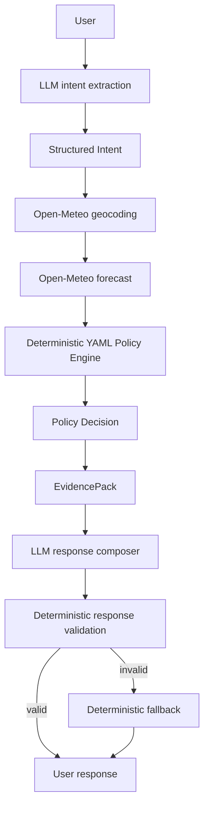

# WeatherGuard

WeatherGuard is a policy-first weather advisory support bot. The LLM interprets language and communicates results; live Open-Meteo data supplies weather facts; external YAML SOPs and deterministic Python code make the safety decision.

## Core principle

> The LLM interprets and communicates; deterministic code decides.

User input never becomes policy data, weather data, a severity value, or a recommendation. The response composer receives only the validated EvidencePack.

## Architecture



The LangGraph implementation uses conditional branches for missing location, geocoding failure, weather failure, no policy match, and response validation failure. A `MemorySaver` checkpoint is keyed by the API session ID, isolating conversations and retaining context for follow-up queries.

## LangGraph flow

1. `parse_intent` extracts activity, category, location, time scope, and user group. Follow-ups inherit missing activity/location from the same thread.
2. `request_location` handles missing location without guessing.
3. `resolve_location` calls Open-Meteo geocoding.
4. `fetch_weather` explicitly requests normalized temperature, wind, precipitation, precipitation probability, and UV fields.
5. `evaluate_policies` evaluates every applicable YAML policy.
6. `resolve_policy_conflict` selects one winner by severity, priority, specificity, then complete policy ID.
7. `build_evidence_pack` creates the source of truth for response composition.
8. `compose_response` writes from that evidence only.
9. `validate_response` checks policy ID, severity, weather grounding, and policy claims.
10. `deterministic_fallback` responds from trusted evidence if validation fails.

## Policy engine

Policies live in `backend/app/policies/*.yaml` and are parsed with `yaml.safe_load`, then validated with Pydantic. The current registry contains 15 SOPs across outdoor exercise, travel, vulnerable groups, and recreation, including low, moderate, high, and critical severities and a multi-factor recreation profile.

Policy evaluation supports numeric comparisons, ranges, membership, `all`, `any`, composite profiles, activity/category matching, and user-group matching. It returns every match with human-readable reasons before deterministic conflict resolution. Policy IDs are data, never Python control-flow branches.

### Adding an SOP

Add another YAML item with the existing schema, then call `POST /api/policies/reload`. No graph, weather, or LLM code changes are required.

```yaml
- id: TR-EXAMPLE-01
  version: "1.0"
  name: "Example travel condition"
  category: travel
  applies_to:
    activities: [commuting]
    categories: [travel]
    user_groups: [adult, general]
  conditions:
    all:
      - field: wind_speed_kmh
        operator: ">="
        value: 45
        description: "Wind reaches the configured threshold"
  severity: high
  priority: 70
  guidance:
    title: "Travel wind advisory"
    recommendation: "Use the configured travel precaution."
  evidence_fields: [wind_speed_kmh]
```

## Weather integration

`OpenMeteoClient` first resolves the location through the Open-Meteo geocoding endpoint, then requests explicit forecast fields from the forecast endpoint. HTTP errors, timeouts, malformed responses, and empty geocoding results become honest graph failure branches. Weather advice is never fabricated.

## API

- `GET /api/health`: readiness and policy count
- `POST /api/chat`: accepts `{ "session_id": "optional", "message": "..." }`
- `GET /api/policies`: lists the registered SOPs
- `POST /api/policies/reload`: reloads YAML policies without changing Python code

## Local setup

Backend:

```powershell
python -m venv .venv
.\.venv\Scripts\Activate.ps1
pip install -r backend/requirements.txt
Copy-Item .env.example .env
python -m uvicorn backend.app.main:app --reload --port 8000
```

Frontend:

```powershell
cd frontend
npm install
Copy-Item .env.example .env
npm run dev
```

Open `http://localhost:5173`. The frontend uses `VITE_API_URL`; Vite proxies `/api` locally when no separate API URL is configured.

## Testing

Run the backend suite with:

```powershell
python -m pytest -q
```

Coverage includes schema validation, policy matching, composite profiles, conflict resolution, LangGraph failure paths, prompt injection regression cases, weather service behavior, response grounding, and session context. The live-weather test uses the configured Open-Meteo client and should be run when network access is available; deterministic unit tests use fixtures and mocks.

The frontend production bundle is verified with:

```powershell
npm --prefix frontend run build
```

Latest local verification: backend `34 passed`, frontend build passed, and the evaluation suite completed `19 PASS`, `0 FAIL`, and `1 NOT_APPLICABLE` across 20 cases on 2026-09-22. The live Open-Meteo processing case passed; the live severe-weather applicability case was honestly marked `NOT_APPLICABLE` because current conditions were not severe. The detailed report is written to `evals/reports/latest_report.md`.

## Security

Requests are validated by Pydantic with bounded message lengths. YAML uses safe loading. User input cannot modify policy registry contents. Secrets belong in `.env` or deployment secret settings and are excluded by `.gitignore`. CORS is configured through `CORS_ORIGINS` and `FRONTEND_URL`, not unrestricted production defaults.

## Deployment

Render can use `render.yaml` or the backend command:

```text
pip install -r backend/requirements.txt
uvicorn backend.app.main:app --host 0.0.0.0 --port $PORT
```

Set `CORS_ORIGINS`, `FRONTEND_URL`, `LLM_PROVIDER`, and the selected provider secret in Render. Open-Meteo requires no API key.

For a production frontend, set `CORS_ORIGINS` to the deployed Vercel origin and set `FRONTEND_URL` to the same origin. Set `LLM_MODEL` when using `openai` or `gemini`; leave provider keys empty when using the default `mock` provider.

For Vercel, set the project root directory to `frontend`, use `npm run build`, and set `VITE_API_URL` to the deployed Render origin, for example `https://weatherguard-5aiu.onrender.com`. The frontend normalizes an optional trailing `/api` suffix and constructs requests such as `https://weatherguard-5aiu.onrender.com/api/chat`; it never duplicates `/api`. The frontend is otherwise a static Vite bundle; `frontend/vercel.json` contains the build defaults.

A simple backend image is available at `backend/Dockerfile`; Docker is optional for local development.

## Limitations

The default `mock` provider is deterministic and offline-friendly, but it is not a general-purpose language model. Live provider structured extraction depends on the configured LangChain provider. Open-Meteo availability and forecast changes can affect live evaluations. The in-memory LangGraph checkpointer is process-local; a multi-instance deployment should use a shared checkpoint store.
